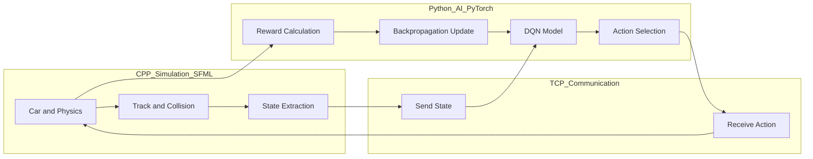

# DQN Learning Car Simulation

A self-learning car that improves through trial and error using deep reinforcement learning.

---

## Overview

This project demonstrates a **real-time Deep Q-Network (DQN)** agent learning to navigate a track without collisions.

Unlike traditional approaches that train offline, this system performs **live learning**, where every mistake immediately updates the model.

---

## Demo


---

## How It Works

The system follows a continuous reinforcement learning loop:

1. The car observes the environment (state)
2. The model selects an action
3. The car moves inside the simulation
4. Reward/penalty is calculated
5. The neural network updates instantly (backpropagation)
6. The cycle repeats

Over time, the agent improves its driving behavior.

---

## Architecture



### Explanation

* The **C++ simulation** handles the environment (car movement, collisions, track).
* The current **state** is sent via TCP to the Python model.
* The **DQN model** predicts the best action.
* The action is sent back to C++ and executed.
* Based on the outcome, a **reward/penalty** is computed.
* The model updates itself in real time using backpropagation.

---

## Key Features

* Real-time reinforcement learning (no offline training)
* Custom-built simulation environment
* Cross-language integration (C++ + Python)
* TCP communication for live decision making
* Continuous improvement through trial and error

---

## Learning Insights

This project highlights that reinforcement learning is not just about models, but about:

* Designing meaningful reward systems
* Managing exploration vs exploitation
* Structuring interaction between environment and agent

---

## Future Improvements

* Add reward visualization graphs
* Improve reward shaping strategy
* Introduce sensor-based inputs (ray casting)
* Support complex track designs
* Experiment with advanced RL algorithms (Double DQN, PPO)

---

## Tech Stack

* C++ (SFML)
* Python (PyTorch)
* TCP Networking

---

## Getting Started

### Prerequisites

* C++ compiler
* Python 3.x
* PyTorch
* SFML

### Installation and Setup

1. Install Python dependencies:

   ```bash
   pip install -r requirements.txt
   ```

2. Install SFML for C++ (follow official instructions for your system).

3. Build and run:

   * Start the Python server
   * Run the C++ simulation

The system will begin training in real time.

---

## Contributing

Contributions, suggestions, and feedback are welcome.

---

## If you found this interesting

If you find this project useful, consider giving it a star.
